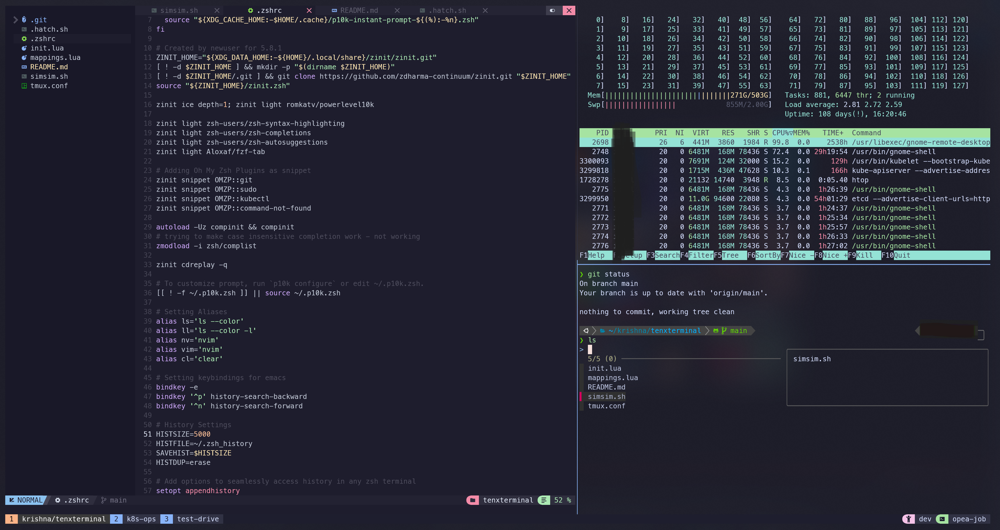

# tenxterminal
Life is too short for looking around the web to polish up your **tmux**, **zsh** and **vim** _(**maybe neovim** - depends on whether you are [young](https://gyydin.mataroa.blog/blog/neovim-is-driving-me-crazy-but-i-cant-stop/) or [wise](https://dev.to/harri_etty/comment/mcbi) or [both](https://www.google.com/search?q=neovim+is+waste+of+time))_ configurations.

>__DISCLAIMER__ : I am yet to be smart enough to build all the tools used in this aesthetics pursuit. I have just gathered, discovered , organized and added scripts.





## Pre-Setup
I run a Windows 11 machine which connects to a remote Ubuntu Server. Following is the pre-setup:

- **Terminal** : Command Prompt running in Windows Terminal 
- **Terminal Font** : [JetBrainsMono Nerd Font Mono](https://github.com/ryanoasis/nerd-fonts/releases/download/v3.2.1/JetBrainsMono.zip) (Sometimes for a new taste, also use [Meslo](https://github.com/romkatv/powerlevel10k?tab=readme-ov-file#meslo-nerd-font-patched-for-powerlevel10k))
- **Theme** : [Catppuccin Mocha](https://github.com/catppuccin/windows-terminal)

Using command prompt inside Windows terminal works best for displaying glyphs in our fancy setup, surprisingly. 

My search for a perfect developement theme came to halt when I found Catppuccin project. It is community driven, available for several CLI and GUI tools and extremely soothing feel on eyes.

### Pre-requisites for Pre-Setup
#### Install Nerd Font
Look for a patched version of your favorite font [here](https://www.nerdfonts.com/font-downloads). This is required because the non-patched version of your favorite font might not contain the glyphs that are required for a *shining and glowing* terminal. If you can't find your font at **Nerd Fonts**, then try some other fonts. If you are picky about your font, try finding a patched font on [Poweline Fonts](https://github.com/powerline/fonts). 

## Installation on Ubuntu 
> __NOTE__ : Installation steps for other systems is coming soon.

Login to your remote ubuntu server, where you'd be spending your rest of life. 

We will install three primary tools here: 

- **tmux**
- **zsh**
- **neovim** 

We will also install some secondary tooling to support enhancements to earlier tools:
    
- **fzf** - Fuzzy finder helping with history of commands
- **nvchad** - A neovim configuration plugin which has a lot of preset and ready to use configs.

**All set!** We don't have to do all these on our own as we are real 10x chad. We will setup our 10x terminal by running a bash script. 

Tmux once installed and started, will have default shell as `zsh`, but only inside tmux. This means default shell on you machine will be still bash (if it was bash earlier).

Run the following command and sit back and relax: 
```bash
git clone https://github.com/krish918/tenxterminal
cd tenxterminal
source simsim.sh
```

I hope all goes well and you will return to bash once this finishes. 

Next step is important. Before we start our 10xterminal, we want to run setup wizards for `zsh` and `neovim`. Let's do that one at a time. For `zsh` the setup wizard is only for the **PowerLevel10k** prompt design setup. Start this by running:

```bash
zsh
```

>__NOTES__: PowerLevel10k is not being maintained anymore.

We will be shown a interactive wizard, which lets us decide how our prompt should look. 

Once done, we will setup neovim. Start neovim by running following: 
```bash 
nvim
```

`neovim` will start with attempting to install several plugins. Run `:MasonInstallAll` command after plugin installation to install most available language servers. Once done, please press `Space + t + h` to select a theme for `neovim`. Of course, we will use **Catppuccin Mocha**. 

With `zsh` and `neovim` configured, we are ready to enter the tmux.

Enter into tmux by running this:

```bash
tmux -u -S 10xSession -n 10xWindow
```

Alternatively, there is an another script that sets up a tmux session and prepares 3 windows with different panes each for developement, operations and testing. You can change the directories to your liking and run the script to have all done instantly : 

```bash
source .hatch.sh
```
You can use this script every time you want to enter your enviornments. You might even add to `.bashrc` file to auto-start every time you login to your shell.

Happy terminaling! Provide comments or raise issues if you find issues.
